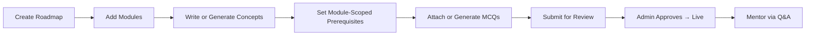

# Knowledge Is Power (KIP) — Instructor Guide

This guide covers how content is structured on KIP, how to author it (by hand or with AI help), how the review-and-publish gate works, and the exact rules behind the XP / streak / badge system. It's written for instructors and admins.

---

## 1. Who can author

Authoring isn't self-serve. A user applies to become an instructor, and an **admin approves** that application before the account can create any content. Until then the studio is read-only.

There are three roles:

- **Student** — reads approved content, takes quizzes, earns XP.
- **Instructor** — authors roadmaps, modules, concepts, and quizzes (once approved), and answers student questions.
- **Admin** — everything an instructor can do, plus the content-review queue, instructor approvals, and user management.

---

## 2. Curriculum architecture & hierarchy

Content is a three-level hierarchy, with quiz questions hanging off the bottom level:

```
┌─────────────────────────────────────────────────────────┐
│                    1. ROADMAP (track)                   │
│       (e.g., "Full-Stack Web Development", "Git")       │
└────────────────────────────┬────────────────────────────┘
                             │ has ordered
┌────────────────────────────▼────────────────────────────┐
│                    2. MODULE (chapter)                  │
│       (e.g., "Module 1: Foundations", "Module 2: CLI")  │
└────────────────────────────┬────────────────────────────┘
                             │ places (ordered)
┌────────────────────────────▼────────────────────────────┐
│              3. CONCEPT (lesson) — via placement         │
│  - Rich GitHub-Flavored Markdown content                │
│  - Difficulty (Easy / Medium / Hard) → drives XP        │
│  - Prerequisites (per module placement)                 │
│  - Review status (pending / approved / rejected)        │
└────────────────────────────┬────────────────────────────┘
                             │ attached to concept
┌────────────────────────────▼────────────────────────────┐
│               4. MCQ QUESTIONS                          │
│  - 4 options (one correct) with per-option explanations │
└─────────────────────────────────────────────────────────┘
```

### Concepts are reusable — that's the important part

A concept isn't owned by one module. It's **attached to a module through a placement** (internally, a "module-concept"). The same concept can be placed in more than one module or roadmap, and each placement carries its own order and its own prerequisites. Write "How Git stores commits" once and reuse it wherever it fits.

### Attributes at each level

| Level | Attributes |
| :--- | :--- |
| **Roadmap** | Title, auto-generated slug, description, creator. Visibility is *not* a per-roadmap toggle — it's governed by each concept's review status (see §5). |
| **Module** | Title, order index (its position in the roadmap). |
| **Concept** | Title, auto-generated slug, content (GitHub-Flavored Markdown), difficulty (**Easy / Medium / Hard** — this drives XP), review status, an AI-generated flag, and author. |
| **Placement** | Which module the concept sits in, its order within that module, and its prerequisites for that module. A concept can only appear once per module. |
| **MCQ question** | Prompt, four options (exactly one correct), a per-option explanation shown after submission, and an order index. |

> **Note:** concepts no longer carry a stored "estimated reading time," and roadmaps no longer have "estimated hours" or a publish flag. If you're working from an older version of this guide, those fields are gone.

---

## 3. Content authoring flow



### Step 1 — Create a roadmap
The high-level track (e.g. *Git Basics*, *TypeScript Pro*). Give it a title and description; the URL slug is generated for you (e.g. `/roadmaps/git-basics`).

### Step 2 — Add modules
Modules are the ordered chapters within a roadmap. Each has a title and a position. You can add them by hand or have AI draft a starter set (see §4).

### Step 3 — Add concepts
Place concepts into a module in the order students should hit them. For each concept you either write the Markdown yourself or generate a draft with AI, then set its **difficulty** — this is what determines how much XP a student earns for completing it.

### Step 4 — Set module-scoped prerequisites
Within a module, you can mark that one concept placement requires another to be completed first. Students see a locked lesson with a note about which prerequisite is blocking it.

Prerequisites live on the **placement**, not on the concept itself. That's deliberate: because a concept can be reused across modules, a prerequisite that made sense in one track would follow it into another where it doesn't apply. Scoping prerequisites to the placement keeps each track's dependencies independent.

### Step 5 — Attach MCQ questions
Attach diagnostic multiple-choice questions to a concept — written by hand or AI-generated. Each question has a prompt, four options with exactly one correct, and an explanation shown to the student after they submit.

### Step 6 — Submit for review
New and edited concepts don't go live on their own. They enter the review queue, and an admin approves or rejects them (see §5). Once approved, the concept is visible to students, and you can answer their questions from the Q&A queue.

---

## 4. AI-assisted authoring

Writing a full course by hand is slow, so KIP can generate drafts for you. The AI is a **starting point, not a publish button** — everything it produces still goes through review, and you're expected to edit it.

### What it can generate
- **Roadmap modules** — a starter module breakdown for a roadmap.
- **Module concepts** — a batch of concepts for a module.
- **Concept content** — the Markdown body of a single concept.
- **Concept MCQs** — quiz questions for a concept (individually or in a batch per module).
- **Q&A answer drafts** — a suggested answer to a student's question.

### How it runs
Generation calls an LLM, which can take anywhere from a few seconds to a couple of minutes, so each request runs as a **background job**. You submit it, get a job you can poll, and carry on working. The studio shows active jobs, a results view for finished ones, and an acknowledge step to clear them once you've reviewed the output.

### Quota
Each instructor/admin gets **20 AI generations per day**. The remaining count is shown in the UI.

### Two things to know
- **AI-generated concepts are flagged** as such and still land in the review queue like everything else. Nothing skips the human gate.
- **Jobs run inside the API process.** If the backend restarts while a job is running, that job is interrupted and you'll need to re-run it — there's no automatic recovery.

---

## 5. Review & publishing workflow

Every concept has a review status: **Pending → Approved / Rejected**. New concepts start as **Pending**.

- **Students only ever see Approved concepts.** Anything pending or rejected is invisible to them.
- **Admins work a content-review queue.** Each pending concept is shown with its full content, difficulty, MCQs, author, and every place it's used (roadmap → module). From there an admin can:
  - **Approve** — publishes the concept live for students.
  - **Reject** — sends it back with a **required feedback reason** the author can act on.
- **Editing re-opens review, but only for real changes.** If an instructor makes a *substantive* edit to an approved concept's content, its status drops back to Pending for re-approval. Trivial edits (a typo fix) don't trigger re-review — the system compares the old and new content and only re-queues when the change is significant enough.
- Each concept records who reviewed it, when, and the rejection reason if there was one.

This whole gate exists because of AI authoring: generating a module in one shot is fast, but fast and correct aren't the same thing, and you don't want unreviewed material — AI-drafted or not — showing up in a student's lesson.

---

## 6. Student progress & completion

```
   [ NOT STARTED ] ──► [ IN PROGRESS ] ──► [ COMPLETED ]
 (first lesson open)   (reading canvas)    (finished + quiz passed)
```

1. **Auto-tracking:** opening a concept moves it to `IN_PROGRESS`.
2. **Completion:** finishing the concept (and passing its quiz, if one is attached) sets it to `COMPLETED`, which awards XP and can unlock badges.
3. **Roadmap progress:** `Progress % = (completed concepts / total concepts) × 100`.

Because students only see approved concepts, progress is only ever measured against published material. Completed concepts also resurface later as spaced-repetition review items, so recall gets reinforced instead of fading after one read.

---

## 7. Gamification — XP, streaks & badges

KIP has a real-time engine that awards XP, tracks streaks, and unlocks badges as students learn.

### A. Experience Points (XP)
XP is awarded the moment a student completes a concept, scaled by its **difficulty**:

| Concept Difficulty | XP Awarded | Instructor Intent |
| :--- | :---: | :--- |
| 🟢 **Easy** | **+10 XP** | Introductory overviews, terminology, setup guides |
| 🟡 **Medium** | **+20 XP** | Core mechanics, syntax tutorials, standard workflows |
| 🔴 **Hard** | **+35 XP** | Advanced architecture, edge cases, complex algorithms |

> **Anti-spam guard:** XP for a given concept is awarded **only once** per student. Re-visiting a completed concept doesn't grant it again.

### B. Learning streaks
- **Consecutive active day:** current streak `+1`.
- **Same-day activity:** streak holds steady, no double-counting.
- **Missed a day:** current streak resets to `1` on the next active day.
- **Longest streak:** tracks the student's all-time record separately.

### C. Automated achievement badges
When a student completes a concept, the engine checks every badge and unlocks any they've newly earned:

| Badge | Criteria Key | Requirement | Category |
| :--- | :--- | :--- | :--- |
| 🚀 **First Steps** | `first_concept` | Complete your **1st concept** | Milestone |
| 📚 **Getting Serious** | `five_concepts` | Complete **5 concepts** | Milestone |
| 🎓 **Dedicated Learner** | `twenty_concepts` | Complete **20 concepts** | Milestone |
| 🔥 **3-Day Streak** | `three_day_streak` | Maintain a **3-day streak** | Consistency |
| ⚡ **Week Warrior** | `seven_day_streak` | Maintain a **7-day streak** | Consistency |
| 🥉 **XP Rookie** | `hundred_xp` | Accumulate **100 total XP** | Mastery |
| 🥇 **XP Grinder** | `five_hundred_xp` | Accumulate **500 total XP** | Mastery |

---

## 8. Instructor Studio & analytics

Logged in as an instructor or admin, the studio gives you:

1. **Course performance** — how many students are working through and completing each concept.
2. **Drop-off spots** — concepts where students stall or take unusually long.
3. **Q&A queue** — a feed of unanswered student questions to respond to (with an optional AI-drafted answer to start from).
4. **AI jobs** — your active generation jobs and their finished results.
5. **Review status** — where each of your concepts sits (pending / approved / rejected) and the admin's feedback on anything that was rejected.
