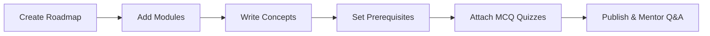

# Knowledge Is Power (KIP) — Comprehensive Instructor Guide

Welcome to the **Knowledge Is Power (KIP)** platform! This guide provides an end-to-end overview of the curriculum architecture, the step-by-step content authoring workflow, and the underlying **XP, Streaks, and Badges** gamification engine.

---

## 1. Curriculum Architecture & Hierarchy

KIP structures learning content into a 4-tier hierarchy:

```
┌─────────────────────────────────────────────────────────┐
│                    1. ROADMAP (Course)                  │
│       (e.g., "Full-Stack Web Development", "Git")       │
└────────────────────────────┬────────────────────────────┘
                             │ Contains 1 or more
┌────────────────────────────▼────────────────────────────┐
│                    2. MODULE (Milestone)                │
│       (e.g., "Module 1: Foundations", "Module 2: CLI")  │
└────────────────────────────┬────────────────────────────┘
                             │ Contains 1 or more
┌────────────────────────────▼────────────────────────────┐
│                    3. CONCEPT (Lesson)                  │
│  - Rich Markdown content                                │
│  - Difficulty (Easy / Medium / Hard)                    │
│  - Reading time (e.g., 5 min)                           │
│  - Prerequisites (concepts that must be finished first) │
└────────────────────────────┬────────────────────────────┘
                             │ Attached to Concept
┌────────────────────────────▼────────────────────────────┐
│               4. MCQ QUIZZES & ASSIGNMENTS              │
│  - 4 Options with explanations                          │
│  - Instant feedback & validation                        │
└─────────────────────────────────────────────────────────┘
```

---

## 2. Step-by-Step Content Authoring Flow



### Step 1: Create a Roadmap
- **What it is**: The high-level learning track (e.g., *Git Basics*, *TypeScript Pro*).
- **Key Attributes**:
  - `Title` & auto-generated URL `Slug` (e.g., `/roadmaps/git-basics`).
  - `Description`: High-level curriculum overview.
  - `Estimated Hours`: Expected time for a student to master the roadmap.
  - `isPublished`: Controls visibility in the public student catalog.

### Step 2: Add Modules
- **What it is**: Logical chapters or milestones within a roadmap.
- **Key Attributes**:
  - `Title` (e.g., *Phase 1: Working with Branches*).
  - `Description`: Goals of this section.
  - `Order Index`: Sequence within the roadmap accordion.

### Step 3: Write Concepts (Lessons)
- **What it is**: The core atomic lesson containing readable content, code blocks, diagrams, and tutorials.
- **Key Attributes**:
  - `Title` & `Slug`.
  - `Content`: Full GitHub Flavored Markdown (headings, code blocks, alerts, formulas).
  - `Difficulty Level`: **Easy**, **Medium**, or **Hard** *(determines XP awarded)*.
  - `Estimated Reading Time`: In minutes (e.g., `8`).

### Step 4: Configure Concept Prerequisites
- Instructors can define dependencies between concepts (e.g., *Concept B requires Concept A*).
- **Enforcement**: If a concept has unmet prerequisites, the student interface locks the lesson with a badge indicating which prerequisite must be completed first.

### Step 5: Attach MCQ Quizzes
- Create diagnostic multiple-choice questions attached directly to a concept.
- **Each Question includes**:
  - Question prompt.
  - 4 selectable options (with 1 marked as correct).
  - Detailed explanation shown to the student upon submission.

### Step 6: Engage in Q&A Discussions
- Every concept has a dedicated **Discussion Thread**.
- Students can ask questions directly from the reading view.
- Instructors receive these questions in their **Instructor Studio** to post verified answers.

---

## 3. Student Progress & Completion Mechanics

```
   [ NOT STARTED ] ──► [ IN PROGRESS ] ──► [ COMPLETED ]
 (First lesson open)   (Reading canvas)    (Passed Quiz / Finished)
```

1. **Auto-Tracking**: When a student opens a concept, its status transitions to `IN_PROGRESS`.
2. **Completion Trigger**: When a student completes the reading and passes the concept's MCQ quiz, status is set to `COMPLETED`.
3. **Roadmap Progress Percentage**: Automatically calculated:
   $$\text{Progress \%} = \left( \frac{\text{Completed Concepts}}{\text{Total Concepts in Roadmap}} \right) \times 100$$

---

## 4. Gamification, XP & Badges System

KIP incorporates a real-time gamification engine to drive student engagement and retention.

### A. Experience Points (XP)
XP is awarded immediately when a student completes a concept based on its **Difficulty**:

| Concept Difficulty | XP Awarded | Instructor Intent |
| :--- | :---: | :--- |
| 🟢 **Easy** | **+10 XP** | Introductory overviews, terminology, setup guides |
| 🟡 **Medium** | **+20 XP** | Core mechanics, syntax tutorials, standard workflows |
| 🔴 **Hard** | **+35 XP** | Advanced architecture, edge-cases, complex algorithms |

> **Anti-Spam Guard**: XP for a specific concept is awarded **only once** per student account.

---

### B. Learning Streaks
- **How it works**: Every calendar day a student completes learning activity, their **Current Streak** increases by +1.
- **Streak Rules**:
  - **Consecutive Active Day**: `Current Streak += 1`
  - **Same Day Activity**: Streak remains intact without double-counting.
  - **Missed Day**: `Current Streak` resets back to `1`.
  - **Longest Streak**: Permanently tracks the user's historical personal record.

---

### C. Automated Achievement Badges
When a student completes a concept, the gamification engine evaluates eligibility across all achievement badges and unlocks new badges automatically:

| Badge Name | Criteria Key | Requirement | Visual Category |
| :--- | :--- | :--- | :--- |
| 🚀 **First Steps** | `first_concept` | Complete your **1st concept** | Milestone |
| 📚 **Getting Serious** | `five_concepts` | Complete **5 concepts** | Milestone |
| 🎓 **Dedicated Learner** | `twenty_concepts` | Complete **20 concepts** | Milestone |
| 🔥 **3-Day Streak** | `three_day_streak` | Maintain a **3-day consecutive streak** | Consistency |
| ⚡ **Week Warrior** | `seven_day_streak` | Maintain a **7-day consecutive streak** | Consistency |
| 🥉 **XP Rookie** | `hundred_xp` | Accumulate **100 total XP** | Mastery |
| 🥇 **XP Grinder** | `five_hundred_xp` | Accumulate **500 total XP** | Mastery |

---

## 5. Instructor Studio & Analytics

When logged in as an Instructor or Admin, the **Instructor Studio** provides:
1. **Course Performance Diagnostics**: Track how many students are enrolled and completing each concept.
2. **Drop-off Identification**: Identify concepts where students struggle or take longer to complete.
3. **Q&A Queue**: Immediate feed of unanswered student questions to mentor learners.
